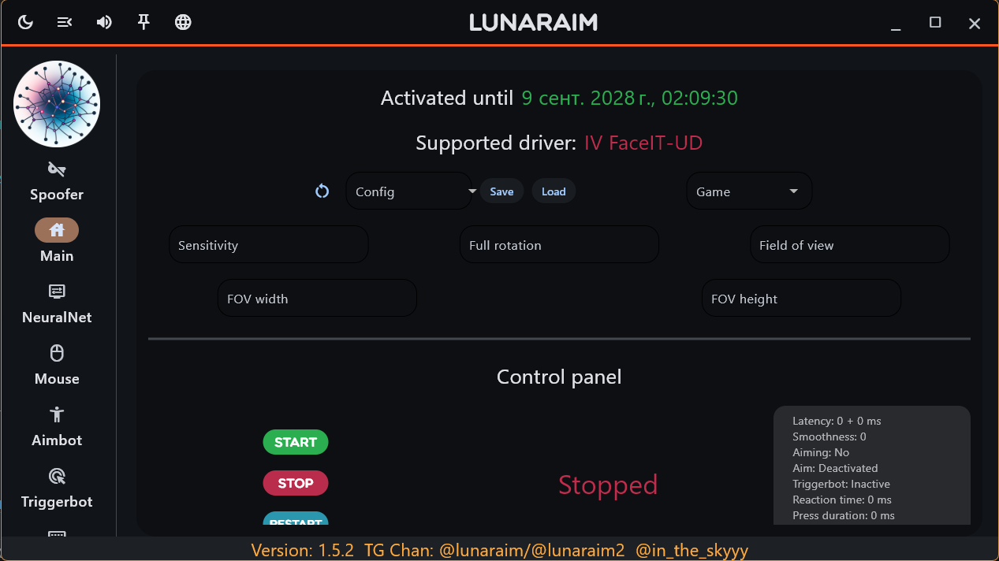
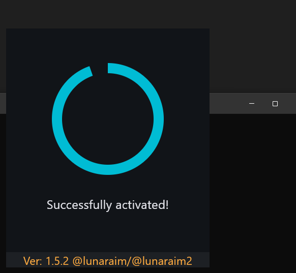

# LunarEngine | Архивный проект (2023-2025)

## ⚠️ ВАЖНО: Этот репозиторий НЕ для практического использования!

**Код полностью устарел и не функционирует** в текущих версиях игры из-за исправленных уязвимостей.  
Проект публикуется **исключительно в образовательных целях** как пример этичного исследования безопасности.

---

  
*Интерфейс инструмента*

  
*Загрузка*

---

## Цель проекта
В 2023–2025 годах этот инструмент был разработан **в white-hat режиме** для:
- Анализа уязвимостей в защите **игр**,
- Демонстрации методов обхода клиентских проверок,
- Формирования детальных отчётов для разработчиков с PoC-кодом.

**Результат**: Все указанные проблемы были **официально исправлены**

---

## Ключевые предупреждения
- ❌ **Код не работает** в актуальных версиях игры и совместим **только с Python 3.11**.  
- ❌ **Запрещено** использовать этот репозиторий для:
  - Модификации игры в коммерческих/некоммерческих целях,
  - Создания работающих читов или инструментов на основе этого кода,
  - Попыток поиска новых уязвимостей/обходов без согласия разработчиков.
- ❌ **Нет поддержки**: Автор **не отвечает** на вопросы по запуску, настройке или вопросы типа «почему не работает». Это **архивный материал**, а не рабочий проект.

---

## Технические детали (для исследователей)
- **Язык**: Python 3.11
- **Зависимости**: Возможно сделаю pip freeze
- **Ограничения**:  
  Код написан для конкретных задач и **не соответствует стандартам качества**:
  - Отсутствует документация,
  - Нет unit-тестов,
  - Много хардкода и экспериментальных решений.

---

## Лицензия
Этот проект распространяется под лицензией [MIT](LICENSE).  
© 2025 [@in_the_skyyy] — **любое использование требует сохранения этого уведомления об авторстве.**

> THE SOFTWARE IS PROVIDED "AS IS", WITHOUT WARRANTY OF ANY KIND...  
> *(полный текст лицензии в файле `LICENSE`)*

---

## Частые вопросы
**Q: Можно ли собрать это и использовать в игре?**  
A: **Нет.** Код несовместим с современными версиями игры, а попытки адаптации нарушат законы и правила GitHub.

**Q: Где взять Python 3.11 и зависимости?**  
A: Автор **не помогает** с настройкой окружения. Цель репозитория — архив, а не инструкция.

**Q: Почему нет инструкций по запуску?**  
A: Это сделано **намеренно**. Код представлен в ознакомительном формате
